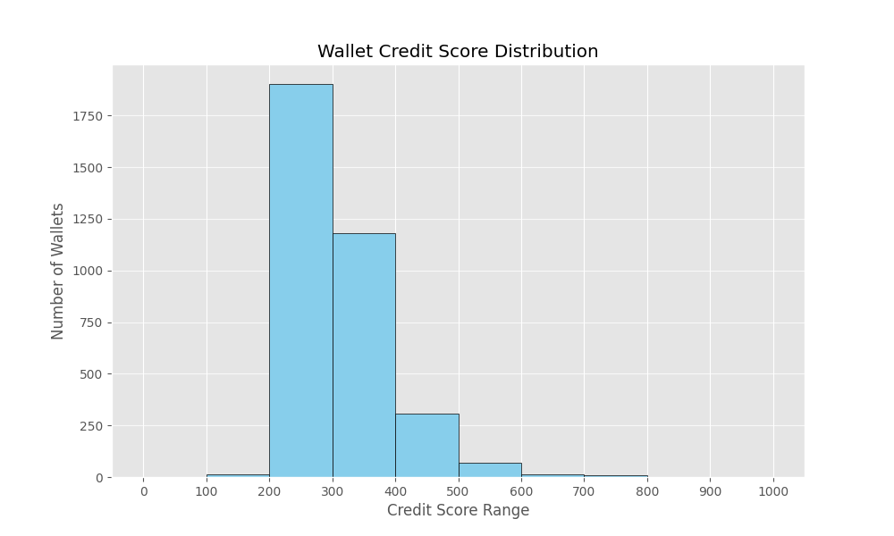

# Analysis of Aave Wallet Credit Scores

This document provides a detailed analysis of the credit scores generated for Aave V2 wallets based on their transaction history. The scoring model assigns a value between 0 and 1000, where higher scores indicate more responsible and reliable behavior.

---

## Score Distribution Graph 📊

The following histogram illustrates the distribution of credit scores across the entire population of 3,497 wallets. The scores are grouped into 10 bins, each representing a 100-point range.

As the graph shows, the majority of wallets are concentrated in the **300-500 score range**, which represents the "average" user on the Aave protocol. There are very few wallets at the extreme ends of the spectrum (below 100 or above 800), suggesting that most users exhibit neither extremely risky nor exceptionally pristine behavior.

---

## Analysis of Wallet Behavior by Score Range

### Lower Range Wallets (Scores 0-300) 📉

Wallets in this bracket are flagged as the highest risk. Their low scores are typically a result of one or more of the following behaviors:

* **Liquidation Events**: The single most significant penalty is for having a `liquidationcall` event. Almost all wallets in this range have been liquidated at least once, signaling a failure to manage their debt effectively.
* **High-Frequency/Bot-like Activity**: Some wallets exhibit a pattern of rapid, small transactions, which our model penalizes as potential bot activity rather than genuine user engagement.
* **Minimal Protocol Engagement**: This category also includes wallets with very few transactions or extremely low volumes, indicating a lack of significant or sustained interaction with the Aave protocol.

### Mid-Range Wallets (Scores 300-600) ↔️

This is the largest cohort and represents the **typical Aave user**. These users are generally responsible but may not be power users. Their behavior includes:

* **Consistent Core Functions**: A healthy history of deposits, borrows, and repayments without any major negative events like liquidations.
* **Moderate Financial Activity**: Their total transaction volume is respectable but not exceptionally high. They are actively using the protocol for its intended purpose.
* **Limited Asset Diversity**: They may only interact with a few key assets (e.g., USDC, ETH) rather than exploring the full range of available markets.

### Higher Range Wallets (Scores 600-1000) 📈

These wallets belong to the most reliable and creditworthy users. They are distinguished by ideal on-chain behavior that indicates both financial health and sophisticated protocol usage.

* **Flawless Repayment History**: These users have **zero liquidation events**. They consistently manage their collateral and debt obligations successfully.
* **Substantial Financial Capacity**: They exhibit high total and average transaction volumes, demonstrating significant trust and financial commitment to the Aave protocol.
* **Diverse and Strategic Use**: Top-scoring wallets often interact with a wide variety of assets, suggesting a deep understanding of DeFi strategies. They are not just passive users but are actively maximizing their capital efficiency within the protocol.

---